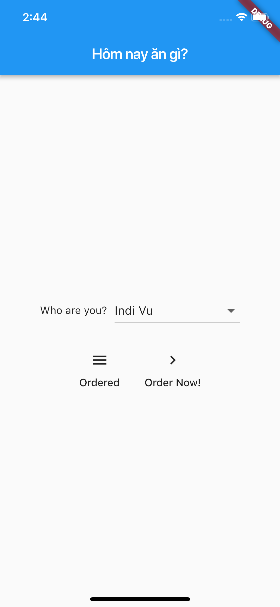
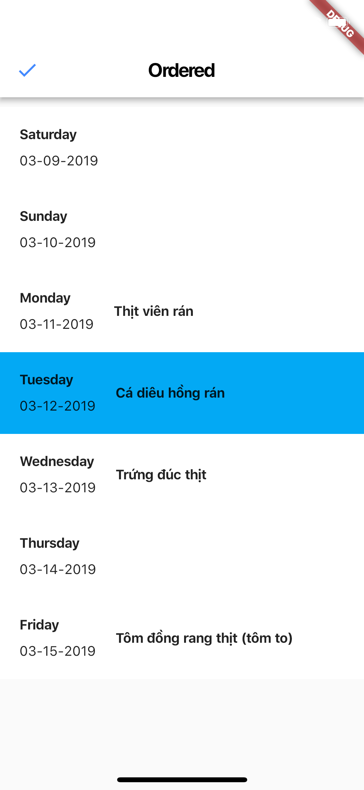
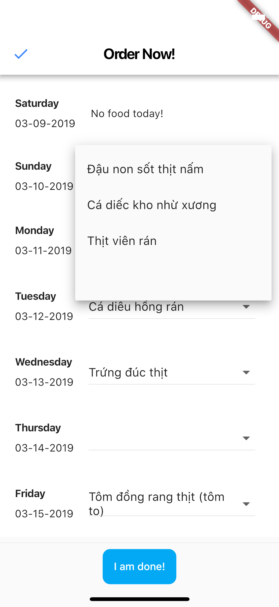
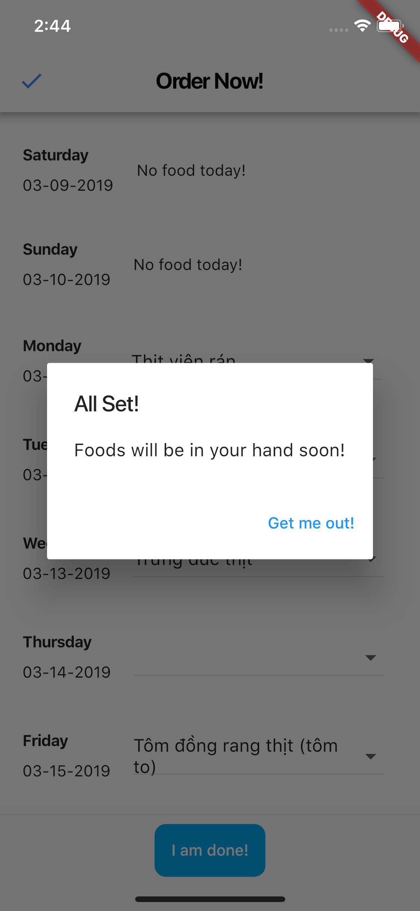

# Simple Flutter application
A simple application with Google APIs (Google Sheets), serverless.

# Context
- Office allows employee order foods for lunch in weekdays.
- Menu is ready from Saturday or Sunday.
- Employees can change order / cancel whenever he wants.
- Tools must be easy to use for kitchen.

# App
- Use Google Sheets to maintain menu, store orders; makes kitchen easily access and update menu.
- Flutter for cross-platform app.
- Notification is set to 8:00am or when spreadsheet is updated.

## Screenshots
- Home screen, load all users: 

- View orders: 
 

- Order screen: 

- Save order successfully: 

## Use

1. Create a Google Spreadsheet follows file format: docs/lunch.xlsx (or just push this file to Google Spreadsheet and update the content).
2. Create a Google Cloud application
3. Enable Google Sheets API. See more on [Google Developer Console](https://console.developers.google.com/apis/api/sheets.googleapis.com/overview).
4. Download credentials, replace **credentials.json**, line 7
5. Replace JSON content in **lib/service.dart**
6. Replace *SPREADSHEET_ID* in **lib/service.dart**, line 25
